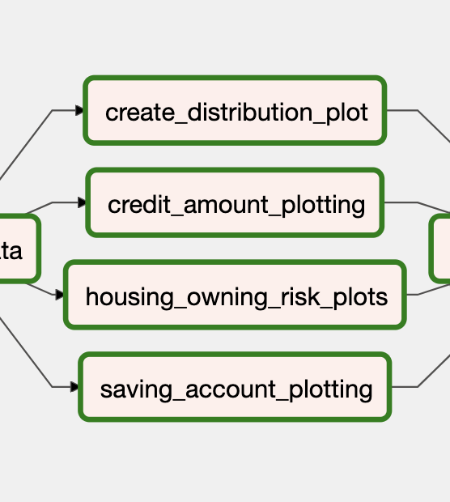
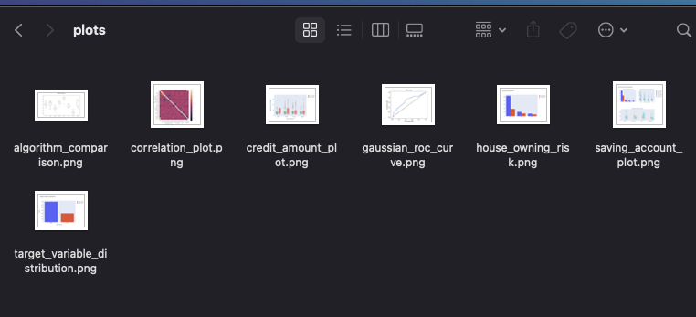
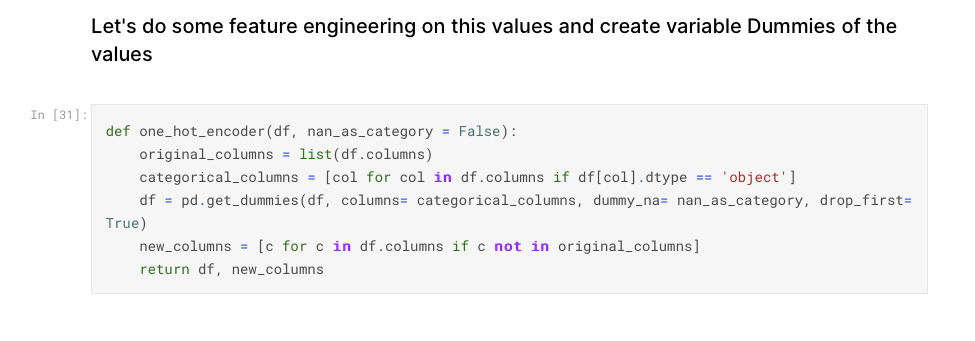
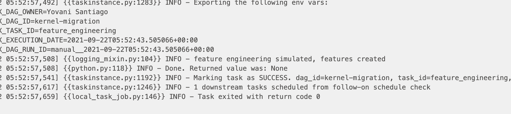
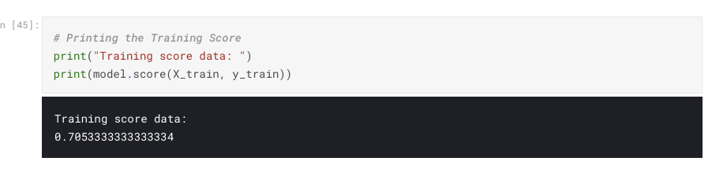
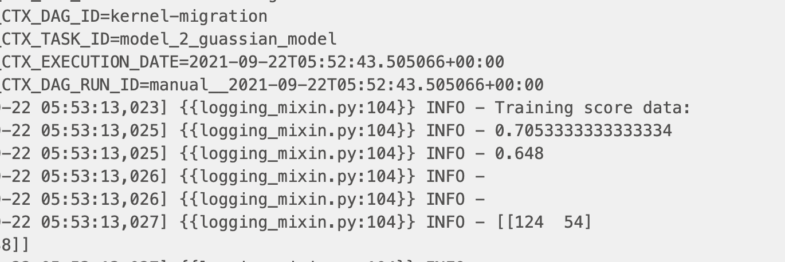
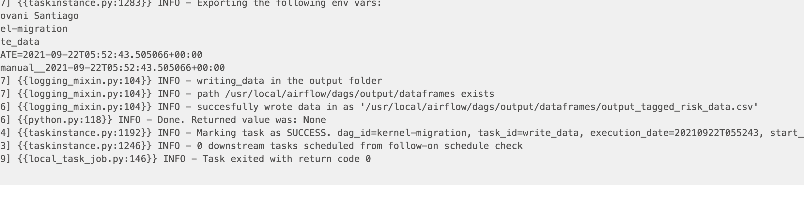

# About aws-mwaa-local-runner

This repository provides a command line interface (CLI) utility that replicates an Amazon Managed Workflows for Apache Airflow (MWAA) environment locally. It will be used to run a kernel migration project DAG.

## About the CLI

The CLI builds a Docker container image locally that’s similar to a MWAA production image. This allows you to run a local Apache Airflow environment to develop and test DAGs, custom plugins, and dependencies before deploying to MWAA.

## What this repo contains

```text
dags/
  requirements.txt
  kernel-migration.py
  input/
    german_credit_data.csv
  output/
    plots/
    dataframes/
docker/
  .gitignore
  mwaa-local-env
  README.md
  config/
    airflow.cfg
    constraints.txt
    requirements.txt
    webserver_config.py
  script/
    bootstrap.sh
    entrypoint.sh
  docker-compose-dbonly.yml
  docker-compose-local.yml
  docker-compose-sequential.yml
  Dockerfile
```

## Prerequisites

- **macOS**: [Install Docker Desktop](https://docs.docker.com/desktop/).
- **Linux/Ubuntu**: [Install Docker Compose](https://docs.docker.com/compose/install/) and [Install Docker Engine](https://docs.docker.com/engine/install/).
- **Windows**: Windows Subsystem for Linux (WSL) to run the bash based command `mwaa-local-env`. Please follow [Windows Subsystem for Linux Installation (WSL)](https://docs.docker.com/docker-for-windows/wsl/) and [Using Docker in WSL 2](https://code.visualstudio.com/blogs/2020/03/02/docker-in-wsl2), to get started.

## Get started

```bash
git clone https://github.com/aws/aws-mwaa-local-runner.git
cd aws-mwaa-local-runner
```

### Step one: Building the Docker image

Build the Docker container image using the following command:

```bash
./mwaa-local-env build-image
```

**Note**: it takes several minutes to build the Docker image locally.

### Step two: Running Apache Airflow

Run Apache Airflow using one of the following database backends.

#### Local runner

Runs a local Apache Airflow environment that is a close representation of MWAA by configuration.

```bash
./mwaa-local-env start
```

To stop the local environment, Ctrl+C on the terminal and wait till the local runner and the postgres containers are stopped.

### Step three: Accessing the Airflow UI

By default, the `bootstrap.sh` script creates a username and password for your local Airflow environment.

- Username: `admin`
- Password: `test`

#### Airflow UI

- Open the Apache Airlfow UI: <http://localhost:8080/>.

### Step four: Run Kernel Migration DAG

In the Airflow UI go the kernel-migration DAG. Activate it and then run it.

#### Requirements.txt

1. Kernel-migration DAG  uses plotly, matplotlib, seaborn and scikit learn, they have been added to`dags/requirements.txt`.  
2. To test a requirements.txt without running Apache Airflow, use the following script:

```bash
./mwaa-local-env test-requirements
```

Let's say you add `aws-batch==0.6` to your `dags/requirements.txt` file. You should see an output similar to:

```bash
Installing requirements.txt
Collecting aws-batch (from -r /usr/local/airflow/dags/requirements.txt (line 1))
  Downloading https://files.pythonhosted.org/packages/5d/11/3aedc6e150d2df6f3d422d7107ac9eba5b50261cf57ab813bb00d8299a34/aws_batch-0.6.tar.gz
Collecting awscli (from aws-batch->-r /usr/local/airflow/dags/requirements.txt (line 1))
  Downloading https://files.pythonhosted.org/packages/07/4a/d054884c2ef4eb3c237e1f4007d3ece5c46e286e4258288f0116724af009/awscli-1.19.21-py2.py3-none-any.whl (3.6MB)
    100% |████████████████████████████████| 3.6MB 365kB/s 
...
...
...
Installing collected packages: botocore, docutils, pyasn1, rsa, awscli, aws-batch
  Running setup.py install for aws-batch ... done
Successfully installed aws-batch-0.6 awscli-1.19.21 botocore-1.20.21 docutils-0.15.2 pyasn1-0.4.8 rsa-4.7.2
```

## Additional Notes for Kernel migration

1 - A lot of unnecesary plotting was removed. This was done because it was not helpful at all. Some plotting is included to demonstrate the DAG capability to do such task. 



Plots are saved in dags/output/plots



2 - Feature engineering task is simulated. The original kernel has a section about feature engineering with a function on it but is not used on the kernel.


That very same function was put into the DAG with a logger that explains the step is just being simulated.




3 - The kernel evaluates two models but None of them is used to classify the complate dataset. In order to comply with the requirement a dataframe used in the correlation plot step is written as final step

Here's the model score on the original kernel:



Here's the model score on the DAG:



Here's the screenshot of the dataframe step succesfully writing a dataframe in dags/output/dataframes path:




## Troubleshooting

The following section contains errors you may encounter when using the Docker container image in this repository.

## My environment is not starting - process failed with dag_stats_table already exists

- If you encountered [the following error](https://issues.apache.org/jira/browse/AIRFLOW-3678): `process fails with "dag_stats_table already exists"`, you'll need to reset your database using the following command:

```bash
./mwaa-local-env reset-db
```

## Security

See [CONTRIBUTING](CONTRIBUTING.md#security-issue-notifications) for more information.

## License

This library is licensed under the MIT-0 License. See the LICENSE file.
